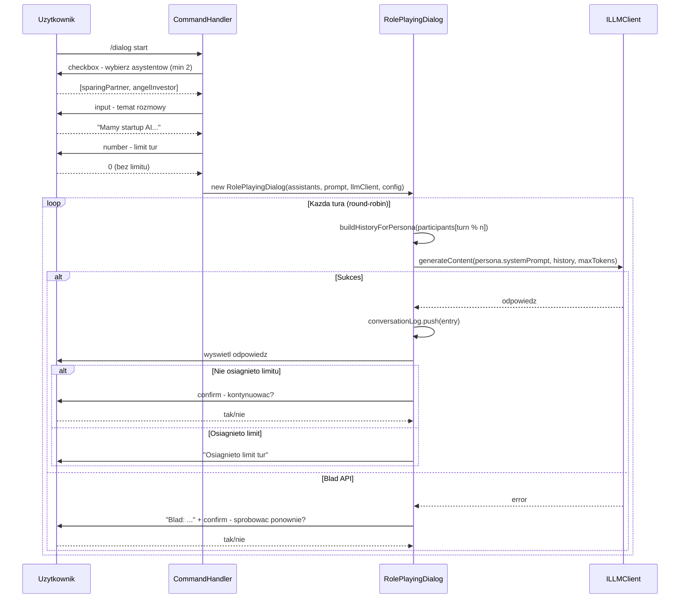

# Role-Playing Dialog Module for AZOR

## Kluczowy koncept do zrozumienia

Caly trick polega na **manipulacji kontekstem LLM-a**. Ten sam model (Claude/Anthropic) bedzie odgrywac role dwoch (lub wiecej) roznych osob. Jak?

- Kazda persona ma inny **system prompt** (role) -- to juz masz w swoich asystentach (`sparingPartner.ts`, `angelInvestor.ts`, etc.)
- Dla kazdej tury wywolujemy `generateContent()` z system promptem aktualnej persony i zmanipulowana historia
- Budujemy **historie konwersacji** tak, aby LLM "myslal", ze jest dana persona:
  - Wlasne wczesniejsze wypowiedzi persony → `role: "model"` (wewnetrznie konwertowane na `assistant` dla Anthropic)
  - Wypowiedzi innych person → `role: "user"` (bo LLM mysli, ze to ktos inny powiedzial)

To jest dokladnie to, co robi referencyjny Python w `M4/role-playing-chat/personas.py` -- my zaadaptujemy to do architektury AZOR-a.

## Decyzje projektowe

- **Persystencja**: Brak zapisu dialogu (pierwsza wersja)
- **Kolejnosc mowienia**: Round-robin (kazdy asystent mowi raz na runde)
- **Limit tur**: Opcjonalny limit automatyczny
- **Max output tokens**: Konfigurowalny dla krotszych odpowiedzi
- **Obsluga bledow**: Przerywamy dialog z komunikatem bledu

## Problem: alternacja rol w historii

Anthropic API wymaga, aby historia wiadomosci **na przemian** zawierala `user` i `assistant`. Nie mozna miec dwoch kolejnych `user` messages. To jest problem, gdy np. persona B widzi:

- `[user: INITIAL_PROMPT, user: odpowiedz_A]` -- dwie kolejne "user"!

**Rozwiazanie**: mergujemy kolejne wiadomosci z ta sama rola w jedna. Np.:

- `[user: "INITIAL_PROMPT\n\n[SPARING PARTNERKA]: odpowiedz_A"]`

Dzieki temu historia zawsze alternuje, a LLM ma pelny kontekst.

**UWAGA**: Wewnetrznie uzywamy `role: "model"` (uniwersalny format), ktory jest konwertowany na `assistant` przez istniejaca funkcje `convertUniversalHistoryToAnthropic()` w `anthropicClient.ts`.

---

## Krok 0: Rozszerz interfejs LLM

**Cel**: Dodac metode `generateContent()` do interfejsu `ILLMClient` - bezposredni odpowiednik Python `generate_content()`.

**Modyfikacja 1**: `src/types/index.ts`

Dodaj do interfejsu `ILLMClient`:

```typescript
/**
 * Generate content directly without chat session
 * Used for role-playing where history is manipulated per-turn
 */
generateContent(
  systemInstruction: string,
  history: Message[],
  maxOutputTokens?: number
): Promise<LLMResponse>;
```

**Modyfikacja 2**: `src/llm/anthropicClient.ts`

Dodaj implementacje metody w klasie `AnthropicLLMClient`:

```typescript
/**
 * Generate content directly without chat session
 * Used for role-playing where history is manipulated per-turn
 */
async generateContent(
  systemInstruction: string,
  history: Message[],
  maxOutputTokens?: number
): Promise<LLMResponse> {
  // Convert universal history to Anthropic format (model -> assistant)
  const anthropicMessages = convertUniversalHistoryToAnthropic(history);

  // Build request
  const requestArgs: Anthropic.MessageCreateParams = {
    model: this.modelName,
    system: systemInstruction,
    messages: anthropicMessages,
    max_tokens: maxOutputTokens || 256,
    temperature: this.modelConfig.temperature,
  };

  // Send message to Anthropic
  const response = await this.client.messages.create(requestArgs);

  // Extract response text
  const responseText = extractTextFromAnthropicResponse(response);

  return { text: responseText };
}
```

**UWAGA**: Metoda wykorzystuje istniejace funkcje pomocnicze:
- `convertUniversalHistoryToAnthropic()` - konwertuje `model` → `assistant`
- `extractTextFromAnthropicResponse()` - wyciaga tekst z odpowiedzi

**Modyfikacja 3**: `src/session/chatSession.ts`

Wyeksportuj funkcje `getSelectedLLMClient()`:

```typescript
// Zmien z:
function getSelectedLLMClient(): ILLMClient { ... }

// Na:
export function getSelectedLLMClient(): ILLMClient { ... }
```

**UWAGA**: Jesli chcesz wspierac rowniez Gemini/Llama, trzeba dodac analogiczna implementacje do `GeminiLLMClient` i `LlamaClient`.

---

## Krok 1: Dodaj typy dla role-playing

**Cel**: Zdefiniowac typy uzywane w module role-playing.

**Modyfikacja**: `src/types/index.ts`

```typescript
/**
 * Single entry in role-playing conversation log
 */
export interface ConversationEntry {
  assistantId: string;
  assistantName: string;
  text: string;
}

/**
 * Configuration for role-playing dialog
 */
export interface RolePlayingConfig {
  /** Maximum number of turns (0 = unlimited) */
  maxTurns: number;
  /** Maximum output tokens per response */
  maxOutputTokens: number;
}

/**
 * Result of a single dialog turn
 */
export interface DialogTurnResult {
  assistantId: string;
  assistantName: string;
  text: string;
  turnNumber: number;
  isLastTurn: boolean;
}
```

---

## Krok 2: Utworz modul `RolePlayingDialog`

**Cel**: Zrozumienie core logiki -- jak orkiestruje sie dialog miedzy personami.

**Nowy plik**: `src/roleplay/rolePlayingDialog.ts`

To jest "serce" calego rozwiazania. Klasa `RolePlayingDialog` bedzie:

- Przechowywac liste uczestnikow (asystentow) i initial prompt
- Prowadzic log calej rozmowy (`conversationLog`)
- Budowac historie dla kazdej persony (`buildHistoryForPersona`)
- Uruchamiac pojedyncza ture (`executeTurn`)
- Obslugiwac bledy API

```typescript
import type { Assistant } from '../assistant/assistant.js';
import type { ILLMClient, Message, ConversationEntry, RolePlayingConfig, DialogTurnResult } from '../types/index.js';

export class RolePlayingDialog {
  private participants: Assistant[];
  private initialPrompt: string;
  private conversationLog: ConversationEntry[] = [];
  private llmClient: ILLMClient;
  private config: RolePlayingConfig;
  private currentTurn: number = 0;

  constructor(
    participants: Assistant[],
    initialPrompt: string,
    llmClient: ILLMClient,
    config: Partial<RolePlayingConfig> = {}
  ) {
    if (participants.length < 2) {
      throw new Error('Dialog requires at least 2 participants');
    }
    this.participants = participants;
    this.initialPrompt = initialPrompt;
    this.llmClient = llmClient;
    this.config = {
      maxTurns: config.maxTurns ?? 0, // 0 = unlimited
      maxOutputTokens: config.maxOutputTokens ?? 256,
    };
  }

  /**
   * Build history from perspective of given persona
   * Own messages = "model", others' messages = "user"
   */
  private buildHistoryForPersona(persona: Assistant): Message[] {
    const rawEntries: { role: 'user' | 'model'; text: string }[] = [];

    // Initial prompt jest zawsze "user" dla kazdej persony
    rawEntries.push({ role: 'user', text: this.initialPrompt });

    // Kazda wypowiedz z loga: wlasna = "model", cudza = "user"
    for (const entry of this.conversationLog) {
      const role = entry.assistantId === persona.id ? 'model' : 'user';
      const prefix = role === 'user' ? `[${entry.assistantName}]: ` : '';
      rawEntries.push({ role, text: prefix + entry.text });
    }

    // Merguj kolejne same-role wiadomosci (wymog Anthropic API - alternacja user/assistant)
    const merged: Message[] = [];
    for (const entry of rawEntries) {
      if (merged.length > 0 && merged[merged.length - 1].role === entry.role) {
        merged[merged.length - 1].parts[0].text += '\n\n' + entry.text;
      } else {
        merged.push({ role: entry.role, parts: [{ text: entry.text }] });
      }
    }

    // Upewnij sie ze ostatnia wiadomosc to "user" (wymagane przez Anthropic)
    if (merged.length > 0 && merged[merged.length - 1].role === 'model') {
      // Dodaj placeholder "user" message
      merged.push({ role: 'user', parts: [{ text: 'Kontynuuj.' }] });
    }

    return merged;
  }

  /**
   * Execute single turn of dialog
   * Returns result or throws on error
   */
  async executeTurn(): Promise<DialogTurnResult> {
    // Determine current participant (round-robin)
    const participantIndex = this.currentTurn % this.participants.length;
    const currentPersona = this.participants[participantIndex];

    // Check turn limit
    const isLastTurn = this.config.maxTurns > 0 &&
                       this.currentTurn >= this.config.maxTurns - 1;

    // Build history for this persona
    const history = this.buildHistoryForPersona(currentPersona);

    // Call LLM
    const response = await this.llmClient.generateContent(
      currentPersona.systemPrompt,
      history,
      this.config.maxOutputTokens
    );

    // Add to conversation log
    const entry: ConversationEntry = {
      assistantId: currentPersona.id,
      assistantName: currentPersona.name,
      text: response.text,
    };
    this.conversationLog.push(entry);

    const result: DialogTurnResult = {
      ...entry,
      turnNumber: this.currentTurn,
      isLastTurn,
    };

    this.currentTurn++;
    return result;
  }

  /**
   * Check if dialog has reached turn limit
   */
  hasReachedLimit(): boolean {
    return this.config.maxTurns > 0 && this.currentTurn >= this.config.maxTurns;
  }

  /**
   * Get current turn number
   */
  getCurrentTurn(): number {
    return this.currentTurn;
  }

  /**
   * Get all participants
   */
  getParticipants(): Assistant[] {
    return this.participants;
  }
}
```

**Dlaczego to dziala**:

- Dla 2 person (A, B), tura 3 persony A: raw = `[user: INITIAL, model: A1, user: B1]` -- naturalnie alternuje
- Dla 2 person, tura 2 persony B: raw = `[user: INITIAL, user: A1]` -- merguje sie do `[user: INITIAL+A1]`
- Dla 3 person (A, B, C), tura 4 persony A: raw = `[user: INITIAL, model: A1, user: B1, user: C1]` -- merguje B1+C1

**Nowy plik**: `src/roleplay/index.ts` -- eksporty modulu

```typescript
export { RolePlayingDialog } from './rolePlayingDialog.js';
```

---

## Krok 3: Utworz komendy CLI dla dialogu

**Cel**: Zrozumienie jak tworzy sie interaktywne komendy z `inquirer`.

**Nowy plik**: `src/commands/roleplay.ts`

Funkcja `startRolePlayingDialog()` bedzie:

1. Pobierac liste asystentow z `AssistantRegistry`
2. Wyswietlic `inquirer.checkbox` -- uzytkownik wybiera 2+ asystentow
3. Wyswietlic `inquirer.input` -- uzytkownik wpisuje temat/initial prompt
4. Opcjonalnie zapytac o limit tur
5. Uruchomic petle dialogowa z obsluga bledow

```typescript
import inquirer from 'inquirer';
import { AssistantRegistry } from '../assistant/registry.js';
import { RolePlayingDialog } from '../roleplay/index.js';
import { getSelectedLLMClient } from '../session/chatSession.js';
import { printAssistant, printError, printInfo, printSuccess, printWarning } from '../cli/console.js';
import { getConfirmation, checkboxFromList } from '../cli/prompt.js';
import type { Assistant } from '../assistant/assistant.js';
import type { RolePlayingConfig } from '../types/index.js';

const DEFAULT_MAX_OUTPUT_TOKENS = 256;

/**
 * Start role-playing dialog interactive setup
 */
export async function startRolePlayingDialog(): Promise<void> {
  // 1. Get available assistants
  const assistants = AssistantRegistry.list();
  if (assistants.length < 2) {
    printError('Potrzeba co najmniej 2 asystentow do dialogu.');
    return;
  }

  // 2. Let user select participants (min 2)
  const choices = assistants.map(a => ({ name: `${a.name} (${a.id})`, value: a }));
  const selectedAssistants = await checkboxFromList<Assistant>(
    'Wybierz uczestnikow dialogu (min. 2):',
    choices
  );

  if (selectedAssistants.length < 2) {
    printError('Anulowano - wybrano mniej niz 2 asystentow.');
    return;
  }

  // 3. Get initial prompt
  const { initialPrompt } = await inquirer.prompt([{
    type: 'input',
    name: 'initialPrompt',
    message: 'Podaj temat rozmowy (initial prompt):',
    validate: (input: string) => input.trim().length > 0 || 'Temat nie moze byc pusty',
  }]);

  // 4. Get optional turn limit
  const { maxTurns } = await inquirer.prompt([{
    type: 'number',
    name: 'maxTurns',
    message: 'Limit tur (0 = bez limitu):',
    default: 0,
  }]);

  // 5. Create dialog
  const llmClient = getSelectedLLMClient();
  const config: Partial<RolePlayingConfig> = {
    maxTurns: maxTurns || 0,
    maxOutputTokens: DEFAULT_MAX_OUTPUT_TOKENS,
  };

  const dialog = new RolePlayingDialog(
    selectedAssistants,
    initialPrompt.trim(),
    llmClient,
    config
  );

  // 6. Show participants
  printSuccess(`\nRozpoczynamy dialog miedzy: ${selectedAssistants.map(a => a.name).join(', ')}`);
  printInfo(`Temat: ${initialPrompt}`);
  if (maxTurns > 0) {
    printInfo(`Limit tur: ${maxTurns}`);
  }
  printInfo('---\n');

  // 7. Run dialog loop
  await runDialogLoop(dialog);
}

/**
 * Main dialog loop with error handling
 */
async function runDialogLoop(dialog: RolePlayingDialog): Promise<void> {
  while (true) {
    try {
      const result = await dialog.executeTurn();

      // Display response
      printAssistant(`\n[${result.assistantName}]: ${result.text}`);
      printInfo(`(tura ${result.turnNumber + 1})`);

      // Check if we hit the limit
      if (result.isLastTurn) {
        printWarning('\nOsiagnieto limit tur. Dialog zakonczony.');
        break;
      }

      // Ask to continue
      const shouldContinue = await getConfirmation('Kontynuowac dialog?');
      if (!shouldContinue) {
        printInfo('Dialog zakonczony przez uzytkownika.');
        break;
      }

    } catch (error) {
      const err = error as Error;
      printError(`\nBlad podczas tury: ${err.message}`);

      const retry = await getConfirmation('Sprobowac ponownie?');
      if (!retry) {
        printInfo('Dialog przerwany z powodu bledu.');
        break;
      }
      // On retry, we just continue the loop (same turn will be attempted)
    }
  }
}
```

Juz masz gotowe helpery w `src/cli/prompt.ts`:

- `selectFromList()` -- do single-select
- `getConfirmation()` -- do yes/no

Brakuje `checkboxFromList()` do multi-select -- dodamy go w nastepnym kroku.

---

## Krok 4: Dodaj `checkboxFromList` do prompt.ts

**Cel**: Rozszerzyc warstwe CLI o multi-select.

**Modyfikacja**: `src/cli/prompt.ts`

Dodaj nowa funkcje analogiczna do istniejacej `selectFromList`, ale z typem `checkbox`:

```typescript
/**
 * Multi-select from a list of options (checkbox)
 * @param minSelection Minimum required selections (default: 2)
 */
export async function checkboxFromList<T>(
  message: string,
  choices: Array<{ name: string; value: T }>,
  minSelection: number = 2
): Promise<T[]> {
  const answers = await inquirer.prompt([{
    type: 'checkbox',
    name: 'selected',
    message,
    choices,
    validate: (input: T[]) =>
      input.length >= minSelection ||
      `Wybierz co najmniej ${minSelection} ${minSelection === 1 ? 'opcję' : 'opcje'}`,
  }]);
  return answers.selected;
}
```

---

## Krok 5: Zintegruj z commandHandler

**Cel**: Podlaczyc nowa komende `/dialog` do istniejacego routingu.

**Modyfikacja 1**: `src/commandHandler.ts`

```typescript
// 1. Dodaj import
import { startRolePlayingDialog } from './commands/roleplay.js';

// 2. Dodaj do VALID_SLASH_COMMANDS
const VALID_SLASH_COMMANDS = [
  '/exit',
  '/quit',
  '/switch',
  '/help',
  '/session',
  '/pdf',
  '/assistant',
  '/dialog',  // <-- NOWE
];

// 3. Dodaj case w switch
case '/dialog':
  await handleDialogSubcommand(args);
  return false;

// 4. Dodaj handler
async function handleDialogSubcommand(args: string[]): Promise<void> {
  if (args.length === 0) {
    printError('Usage: /dialog <start>');
    return;
  }

  const subcommand = args[0].toLowerCase();

  switch (subcommand) {
    case 'start':
      await startRolePlayingDialog();
      break;
    default:
      printError(`Unknown subcommand: ${subcommand}`);
      printInfo('Available: start');
  }
}
```

**Modyfikacja 2**: `src/cli/prompt.ts`

Dodaj `/dialog` do obiektu `commands`:

```typescript
const commands: Record<string, string[]> = {
  '/session': ['list', 'display', 'new', 'clear', 'pop', 'remove'],
  '/switch': [],
  '/help': [],
  '/exit': [],
  '/quit': [],
  '/pdf': [],
  '/assistant': ['list', 'switch', 'current', 'create'],  // <-- jesli brakuje
  '/dialog': ['start'],  // <-- NOWE
};
```

**Modyfikacja 3**: `src/cli/console.ts`

Dodaj do `displayHelp()`:

```typescript
printHelp('\n  /dialog start     - Rozpoczyna autonomiczny dialog miedzy asystentami.');
```

---

## Krok 6: Testowanie

Uruchom `npm run dev` i przetestuj:

1. `/dialog start` -- powinien wyswietlic checkbox z asystentami
2. Wybierz np. `sparing-partner` i `angel-investor` (spacja = zaznacz, enter = potwierdz)
3. Wpisz temat: "Mamy startup AI ktory nie ma jeszcze przychodow ale ma 10k userow"
4. Wpisz limit tur: 0 (bez limitu) lub np. 6
5. Obserwuj jak persony dyskutuja
6. Przetestuj przerwanie dialogu (odpowiedz "nie" na pytanie o kontynuacje)
7. Przetestuj z 3 asystentami (round-robin)
8. Przetestuj obsluge bledow (np. odlacz internet w trakcie)
9. Przetestuj limit tur (ustaw np. 4 i sprawdz czy sie zatrzymuje)

**Scenariusze testowe**:

| Scenariusz                  | Oczekiwany wynik                                   |
| --------------------------- | -------------------------------------------------- |
| Wybor 1 asystenta           | Blad "Wybierz co najmniej 2"                       |
| Pusty temat                 | Blad walidacji                                     |
| 2 asystentow, bez limitu    | Dialog trwa do przerwania                          |
| 3 asystentow, limit 6       | A→B→C→A→B→C, potem "Osiagnieto limit tur"          |
| Blad API                    | Komunikat bledu + pytanie "Sprobowac ponownie?"    |
| Ctrl+C                      | Zakonczenie chatbota (standardowe zachowanie)      |

---

## Podsumowanie plikow

| Akcja | Plik                                                       |
| ----- | ---------------------------------------------------------- |
| EDIT  | `src/types/index.ts` -- nowe typy + rozszerzenie ILLMClient |
| EDIT  | `src/llm/anthropicClient.ts` -- metoda generateContent()   |
| EDIT  | `src/session/chatSession.ts` -- eksport getSelectedLLMClient |
| NOWY  | `src/roleplay/rolePlayingDialog.ts` -- core orkiestrator   |
| NOWY  | `src/roleplay/index.ts` -- eksporty                        |
| NOWY  | `src/commands/roleplay.ts` -- komendy CLI                  |
| EDIT  | `src/cli/prompt.ts` -- dodanie checkboxFromList            |
| EDIT  | `src/commandHandler.ts` -- routing /dialog                 |
| EDIT  | `src/cli/console.ts` -- help                               |

---

## Diagram przepływu (zaktualizowany)




